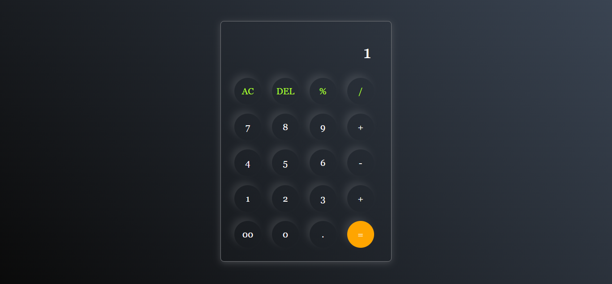

# Modern Calculator 🧮

A sleek, responsive, and functional calculator built using HTML, CSS, and Vanilla JavaScript. This project features a modern dark-themed UI with glassmorphism-inspired design elements.

## 🚀 Features

- **Basic Arithmetic:** Perform addition, subtraction, multiplication, and division.
- **Advanced Controls:**
  - `AC`: Clear the entire display.
  - `DEL`: Remove the last entered character.
  - `=`: Calculate the result.
- **Modern UI:** 
  - Dark mode aesthetic with a linear gradient background.
  - Circular buttons with subtle box shadows.
  - Responsive layout that centers the calculator on any screen size.
- **Glassmorphism Effects:** Uses transparent backgrounds and borders for a premium feel.

## 🛠️ Technologies Used

- **HTML5:** For the structural layout.
- **CSS3:** For styling, including Flexbox, gradients, and shadows.
- **JavaScript (ES6):** For the calculation logic and DOM manipulation.

## 📸 Screenshots



## 📂 Project Structure

```text
calculator/
├── index.html    # Main HTML file
├── style.css     # Styling for the calculator
└── script.js     # Logic and event handling
```

## ⚙️ How to Run

1. Clone or download this repository.
2. Navigate to the `calculator` directory.
3. Open `index.html` in your favorite web browser.
