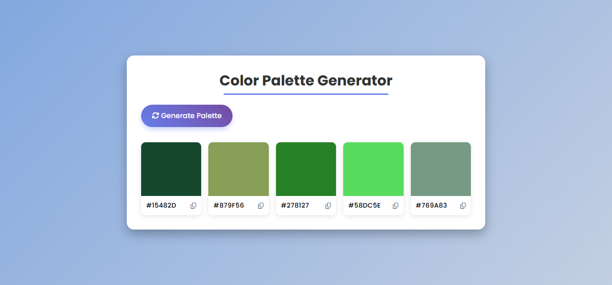

# Color Palette Generator

A lightweight JavaScript project that generates random color palettes and displays them in the browser. Perfect for designers, developers, or anyone looking for quick color inspiration.

## Features

- Generate a fresh set of random colors with a single click.
- Copy individual color hex codes to the clipboard.
- Responsive layout with a modern, glass‑morphism UI.
- Pure JavaScript – no external libraries required.

## Demo

Open `index.html` in a browser and click the **Generate** button to see a new palette appear.

## Getting Started

1. **Clone or download** this repository.
2. Open `index.html` in your favorite browser (no server required).
3. Click **Generate** to create a new palette.

## Project Structure

```
color-pallete-generator/
├─ index.html      # Main HTML entry point
├─ style.css       # Styling with modern aesthetics (dark mode, gradients)
├─ script.js       # Core JavaScript logic for palette generation
└─ README.md       # Project documentation (this file)
```

## Customization

- **Change the number of colors**: Adjust the `PALETTE_SIZE` constant in `script.js`.
- **Style tweaks**: Edit `style.css` to modify colors, fonts, or layout.

## Screenshot


