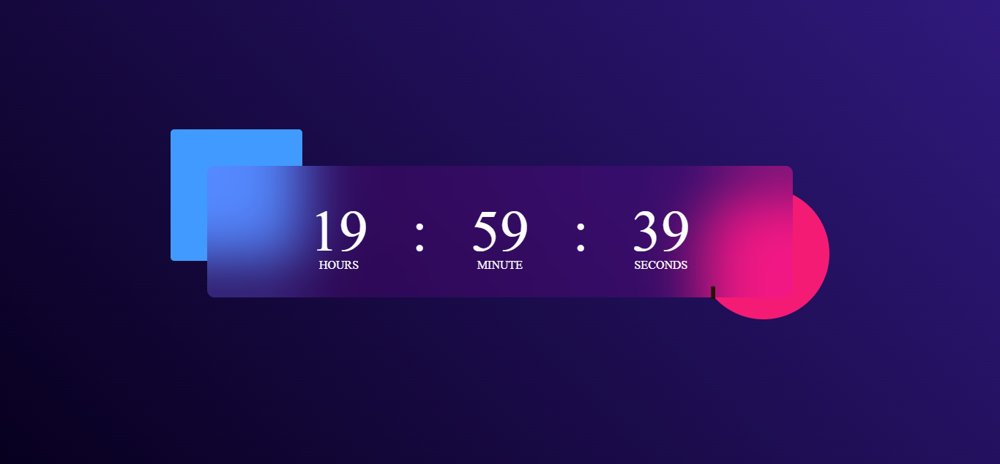

# Digital Clock

A simple, stylish digital clock built with **HTML**, **CSS**, and **JavaScript**. The clock displays the current time in a 12‑hour format with AM/PM indicator and updates every second.

---

## ✨ Features
- Real‑time updating every second
- 12‑hour format with leading zeros
- Responsive layout that works on desktop and mobile
- Clean, modern design using CSS variables and subtle animations
- Easy to customize colors and fonts

---

## 🛠️ Installation & Usage
1. **Clone or download** the repository.
2. Open `index.html` in any modern web browser.
3. The clock will start automatically, showing the current local time.

No additional dependencies or build steps are required.

---

## 📸 Screenshot
*(A live preview of the clock)*



> *Replace the above URL with an actual screenshot if available.*

---

## 📂 Project Structure
```
 digital-clock/
 ├─ index.html   # HTML markup
 ├─ style.css    # Styling and animations
 └─ script.js    # JavaScript logic for time handling
```

---

## 🎨 Customization
Edit `style.css` to change colors, fonts, or add background effects. The clock uses CSS variables for easy theming:
