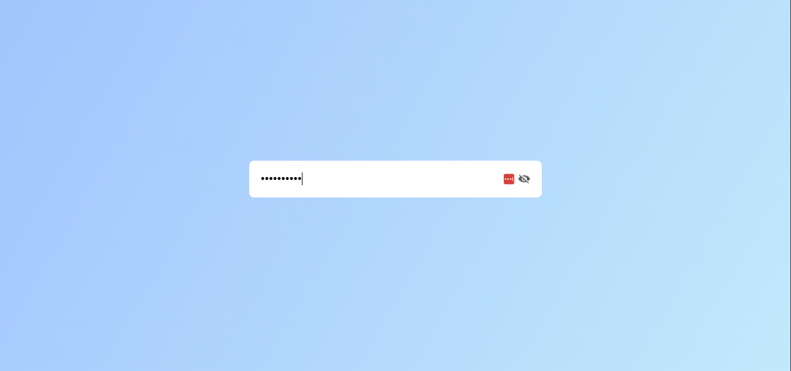

# Hide & Show Password Demo

> A sleek, lightweight demo that lets users toggle password visibility with a single click.

## ✨ Features
- **Modern UI**: Clean input box with an animated eye icon.
- **Pure JavaScript**: No libraries, just vanilla JS.
- **Responsive**: Works on desktop and mobile.

## 🛠️ Tech Stack
- **HTML5** – Semantic markup
- **CSS3** – Custom styling, glass‑morphism effect
- **JavaScript** – Event handling for the eye toggle

## 📂 Project Structure
```
hide-show-password/
├─ index.html   # Markup with password input and eye icon
├─ style.css    # Stylish, dark‑mode ready CSS
├─ script.js    # Toggle logic
└─ README.md    # This guide
```

## 🎨 Design Highlights
- **Glassmorphism** container with subtle backdrop blur.
- **Smooth hover animation** on the eye icon.
- **Accessible**: Uses proper `type` attribute swapping and `alt` text.

## 📸 Screenshot


## 🚀 How to Run
1. Open `index.html` in any modern browser.
2. Type a password into the input field.
3. Click the 👁️ icon to **show** or **hide** the password.